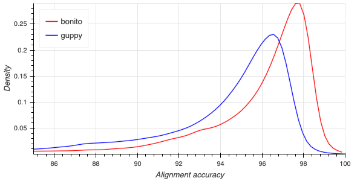

We are please to announce the addition of
[bonito](https://github.com/nanoporetech/bonito) basecalling results to the
GM24385 dataset. Bonito is a research-grade, open source basecaller utilising
the [PyTorch](https://pytorch.org/) library; its development explores
alternative basecalling frameworks to those use in the product-grade Guppy
basecalling software.

The Bonito basecalling for the GM24385 dataset was performed using an early
version 0.3.0 (*amendment 2020-10-28: the version used implements a different
algorithm to that in the released Bonito v0.3.0*),
driven by the same [katuali](/katuali_human_pipeline/) analysis
pipeline as for the initial dataset release.  The Bonito basecaller was
provided as input the per-chromosome `.fast5` files created in the initial
pipeline via alignment of the Guppy 4.0.11 basecalls. This allows for easy
comparison of results on subsets of the data (but may lead to subtle
side-effects). For example the analysis data structure contains now entries of
the form:

    gm24385_2020.09/analysis/r9.4.1/{flowcell}/guppy_{suffix}/align_unfiltered/{chromosome}/bonito
    ├── align_unfiltered
    │   ├── align_to_ref.log
    │   ├── basecall_stats.log
    │   ├── calls2ref.bam
    │   ├── calls2ref.bam.bai
    │   └── calls2ref_stats.txt
    └── basecalls.fastq.gz

The file `basecalls.fastq.gz` contains the basecalling results from Bonito. The
quality scores in these files have been mocked as the pre-release build of Bonito used
does not yet provide quality scores. Similar to the main folder structure the
`align_unfiltered` directory contains unfiltered alignments of the basecalls to
the reference sequence (`calls2ref.bam`) along with text files summarizing the
properties of the alignments.

### Comparison with Guppy 4.0.11 basecalls

As a basis for comparison with the current Guppy basecaller we can use the alignment summary
files for both the Guppy and Bonito basecalls. To simplify the analysis we compare only chromosome 1
data for a single flowcell; we can download the files with:

    aws s3 cp --no-sign-request s3://ont-open-data/gm24385_2020.09/analysis/r9.4.1/20200914_1354_6B_PAF27096_e7c9eae6/guppy_v4.0.11_r9.4.1_hac_prom/align_unfiltered/chr1/calls2ref_stats.txt guppy.stats
    aws s3 cp --no-sign-request s3://ont-open-data/gm24385_2020.09/analysis/r9.4.1/20200914_1354_6B_PAF27096_e7c9eae6/guppy_v4.0.11_r9.4.1_hac_prom/align_unfiltered/chr1/bonito/align_unfiltered/calls2ref_stats.txt bonito.stats

The following python code,

    from concurrent.futures import ProcessPoolExecutor
    
    import pandas as pd
    
    import aplanat.util
    from aplanat import lines
    from aplanat.layouts import facet_grid
    from aplanat.report import HTMLReport
    
    
    def read_data(args):
        caller, filename = args
        df = pd.read_csv(filename, sep='\t')
        xs, ys = aplanat.util.kernel_density_estimate(df['acc'], step=0.2)
        df = pd.DataFrame({'accuracy':xs, 'density':ys})
        df['caller'] = caller
        return df
    
    data_sets = {
        'bonito': 'bonito.stats',
        'guppy': 'guppy.stats'}
    
    with ProcessPoolExecutor() as executor:
        report = HTMLReport("Basecalling Accuracy Summary", "GM24385")
        dfs = list(executor.map(read_data, data_sets.items()))
    plot = lines.line(
        [df['accuracy'] for df in dfs],
        [df['density'] for df in dfs],
        colors=['red', 'blue'],
        names=['bonito', 'guppy'],
        xlim=(85,100),
        x_axis_label='Alignment accuracy',
        y_axis_label='Density')
    plot.legend.location = 'top_left'
    report.plot(plot)
    report.write("report.html")

can be used to plot a kernel density estimate for the read alignment accuracy:

The plot indicates a decrease of one-third in the modal error of reads.
