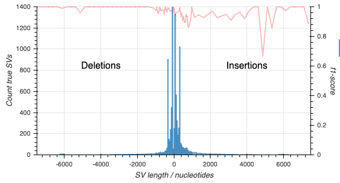

In this blog post we will explore structural variant calling using the
[recently released](/gm24385_2020.11) HG002 (GM24385 Ashkenazi Son) data
release.

The GM24385 dataset comprises whole genome sequencing of a well-characterised
human cell line. It therefore provides a useful benchmark sample; the cell line
was also used as a "seen" sample in the recent
[https://precision.fda.gov/challenges/10/view/results](PrecisionFDA Truth
Challenge V2) competition for small variant calling.

### Structural variant calling with lra and cuteSV

As an easily reproducible example we will focus on a single flowcell of the
GM24385 2020.11 data release.

> *This walkthrough assumes some familiarity with standard bioinformatic tools
> for handling genomics data. A working installation of
> [samtools](http://www.htslib.org/),
> [snakemake](https://snakemake.readthedocs.io/en/stable/),
> [git](https://git-scm.com/), and the [AWS command-line
> tools](https://aws.amazon.com/cli/) are required to follow the process
> below.*

#### Data preparation

We will start by downloading Guppy 4.0.11 basecalls from a PromethION
sequencing experiment (see our [tutorial](/tutorials) FAQs) for more
information on downloading data):

    aws s3 --no-sign-request cp \
        s3://ont-open-data/gm24385_2020.11/analysis/r9.4.1/20201026_1644_2-E5-H5_PAG07162_d7f262d5/guppy_v4.0.11_r9.4.1_hac_prom/basecalls.fastq.gz \
        basecalls.fastq.gz

The `.fastq` file downloaded above contains the QC pass calls from the experiment
amounting to around 200 Gbases.

To run the SV calling pipeline and perform benchmarking we will need release 37
of the human reference sequence:

    wget http://ftp-trace.ncbi.nih.gov/1000genomes/ftp/technical/reference/human_g1k_v37.fasta.gz

#### Running the variant calling

To perform structural variant calling Oxford Nanopore Technologies recommends
using the
[pipeline-structural-variation](https://github.com/nanoporetech/pipeline-structural-variation)
snakemake workflow.  This workflow as been recently updated to use
[lra](https://github.com/ChaissonLab/LRA) and
[cuteSV](https://github.com/tjiangHIT/cuteSV), replacing the previous
[minimap2](https://github.com/lh3/minimap2) and
[sniffles](https://github.com/fritzsedlazeck/Sniffles) based approach. After
installation of this software we use it with its default settings:

    conda activate pipeline-structural-variation-v2
    snakemake call --config \
        input_fastq=basecalls.fastq.gz \
        reference_fasta=human_g1k_v37.fasta \
        threads=76 \
        sample_name=PAG07162-hg37

The useful output for our purposes is the single Variant Call Format file; a copy
of the file is available in the dataset S3 bucket at:

    s3://ont-open-data/gm24385_2020.11/extra_analyses/PAG07162-hg37/sv_calls/PAG07162-hg37_cutesv_filtered.vcf.gz

### Evaluation

The veracity of the variant calling performed above can be obtained by
comparing the results to the [Genome In A
Bottle](https://www.nist.gov/programs-projects/genome-bottle) truth sets for
the GM24385 sample. The truth sets can be downloaded from the
[NCBI](https://www.ncbi.nlm.nih.gov/) repository:

    truth_name="HG002_SVs_Tier1_v0.6"
    for ext in ".vcf.gz", ".vcf.gz.tbi", ".bed"; do
        wget -O $truth_name$ext \
            https://ftp-trace.ncbi.nlm.nih.gov/giab/ftp/data/AshkenazimTrio/analysis/NIST_SVs_Integration_v0.6/$truth_name$ext
    done

With these reference data we will use
[truvari](https://github.com/spiralgenetics/truvari) to assess the recall and precision
of the variant calls made by the calling pipeline:

    truth_vcf="${truth_name}.vcf.gz"
    truth_bed="${truth_name}.bed"
    reference="human_g1k_v37.fasta"
    input_vcf="PAG07162-hg37_cutesv_filtered.vcf.gz"
    output_dir="truvari"
    truvari bench --passonly --pctsim 0 \
        -b $truth_vcf --includebed $truth_bed \
        -f $reference -c $input_vcf \
        -o $output_dir

Truvari outputs precision and recall figures for the structural variants.  With
a little work (detailed in the [EPI2MELabs Structural Variation
Benchmarking](https://epi2me-labs.github.io/) tutorial) we can separate the
counts for deletion and insertion (including duplication) variants:

|     Type        |     Deletions   |   Insertions    |
|-----------------|-----------------|-----------------|
|     Recall      |     0.9667      |     0.9427      |
|     Precision   |     0.9893      |     0.9667      |
|     f1-score    |     0.9779      |     0.9545      |

With still a little more work we can produce the following depicting the
f1-score alongwith counts of SVs in the truthset:

