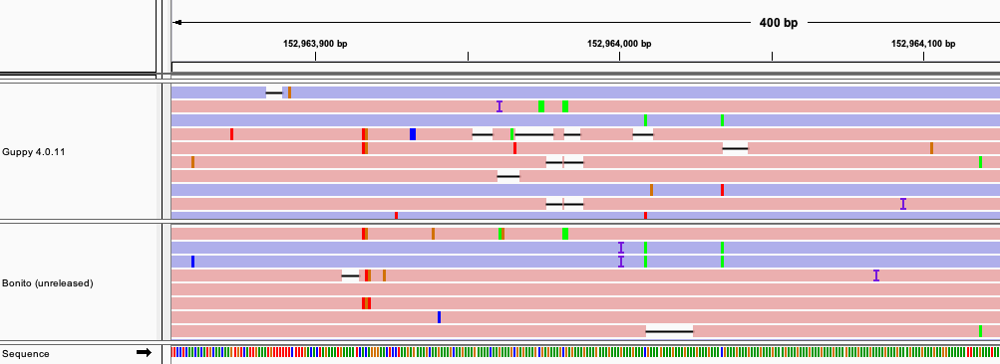

In this blog post we will explore small variant calling using the [previously
released](/gm24385_2020.09) HG002 (GM24385 Ashkenazi Son) data release.

The GM24385 dataset comprises whole genome sequencing of a well-characterised
human cell line. It therefore provides a useful benchmark sample; the cell line
was also used as a "seen" sample in the recent
[https://precision.fda.gov/challenges/10/view/results](PrecisionFDA Truth
Challenge V2) competition.

### Variant Calling with Medaka and DeepVariant

As an easily reproducible example we will focus on chromosome 20 of the genome
rather than performing computation on the whole genome.

> *This walkthrough assumes some familiarity with standard bioinformatic tools
> for handling genomics data. A working installation of
> [samtools](http://www.htslib.org/),
> [bedtools](https://bedtools.readthedocs.io/en/latest/),
> [medaka](https://github.com/nanoporetech/medaka),
> [docker](https://www.docker.com/get-started), and the [AWS command-line
> tools](https://aws.amazon.com/cli/) are required to follow the process
> below.*

#### Data preparation

To start let us download the pre-aligned reads corresponding to chromosome 20
from the dataset resource (see our [tutorial](/tutorials) FAQs) for more
information on downloading data):

    for ext in .bam .bam.bai; do
        aws s3 --no-sign-request cp s3://ont-open-data/gm24385_2020.09/analysis/r9.4.1/20200914_1354_6B_PAF27096_e7c9eae6/guppy_v4.0.11_r9.4.1_hac_prom/align_unfiltered/chr20/calls2ref${ext} PAF27096.chr20${ext}
        aws s3 --no-sign-request cp s3://ont-open-data/gm24385_2020.09/analysis/r9.4.1/20200914_1357_1-E11-H11_PAF27462_d3c9678e/guppy_v4.0.11_r9.4.1_hac_prom/align_unfiltered/chr20/calls2ref${ext} PAF27462.chr20${ext}
    done

and merge these into a single `.bam` file:

    samtools merge chr20.bam PAF27096.chr20.bam PAF27462.chr20.bam
    samtools index chr20.bam

As an additional step we will filter the `chr20.bam` file to leave only primary
alignments, removing secondary and supplementary alignments. This is necessary
as DeepVariant, which we will use later, will otherwise process these
additional alignments.

    samtools view chr20.bam -F 2308 -@ 64 -b > chr20.primary.bam
    samtools index chr20.primary.bam

To perform variant calling we also require the human reference sequence, the
same sequence as used to create the alignment files prepared above. An indexed
copy of this is available from the dataset resource:

    for ext in .fasta .fasta.fai; do
        aws s3 --no-sign-request cp s3://ont-open-data/gm24385_2020.09/config/ref/GCA_000001405.15_GRCh38_no_alt_analysis_set${ext} .
    done

We have now all the inputs required to perform variant calling with medaka
and DeepVariant.

#### Running Medaka

[Medaka](https://github.com/nanoporetech/medaka) is Oxford Nanopore
Technologies' software for performing consensus and small variant calling from
nanopore long-read data. It can perform diploid variant calling either in
isolation or in tandem with
[DeepVariant](https://github.com/google/deepvariant); to enable this second
use-case small modifications have been made to how medaka represents variants
to allow it to function as a variant-candidate generator for DeepVariant.

To perform candidate generation with medaka we run:

    medaka_variant -i chr20.primary.bam -f GCA_000001405.15_GRCh38_no_alt_analysis_set.fasta \
        -r chr20 -t 8 -P 0 -l

The final two options here (`-P 0 -l`) instruct medaka to leave its
substitution calls unfiltered and to decompose multi-nucleotide substitutions
into independent single nucleotide substitutions. Details of workflow employed
by the `medaka_variant` program can be found in the medaka
[documentation](https://nanoporetech.github.io/medaka/snp.html#).

The result of running the above command will be a directory `medaka_variant`
containing (amongst other files):

 * *`round_0_hap_mixed_phased.bam`*: alignments (as in `chr20.primary.bam`), tagged with a calculated haplotype,
 * *`round_1.vcf`*: the final output variant candidates for DeepVariant.

#### Running DeepVariant

With variant-candidate generation performed by medaka we can now use
DeepVariant to calculate our final variant calls. In order to simplify this we
will download a program that automates the execution of the docker container
used to run DeepVariant:

    wget https://gist.githubusercontent.com/cjw85/23d2b0675ec5a5c7fd4074456524c971/raw/c716c85639f047b9a9cff2079be2868bccb61659/run_deepvariant.sh
    chmod +x run_deepvariant.sh

This script simply gathers together the required inputs before executing
DeepVariant within the docker container, it can be run simply with:

    ./run_deepvariant.sh \
        -b medaka_variant/round_0_hap_mixed_phased.bam \
        -v medaka_variant/round_1.vcf \
        -r GCA_000001405.15_GRCh38_no_alt_analysis_set.fasta \
        -o deep_variant -t 64 -q

The final variant calls will be present at `deepvariant/deepvariant.vcf.gz`.
The `-q` option here runs a "high quality" version of the DeepVariant
calculation; this version incurs a runtime cost of aaround a factor of
four and gives marginable improvement in results.

### Evaluation

The veracity of the variant calling performed above can be obtained by
comparing the results to the [Genome In A
Bottle](https://www.nist.gov/programs-projects/genome-bottle) truth sets for
the GM24385 sample. The truth sets can be downloaded from the
[NCBI](https://www.ncbi.nlm.nih.gov/) repository:

    for ext in .bed .bed.gz .bed.gz.tbi .vcf.gz .vcf.gz.tbi; do
        wget https://ftp-trace.ncbi.nlm.nih.gov/ReferenceSamples/giab/release/AshkenazimTrio/HG002_NA24385_son/NISTv4.1/GRCh38/HG002_GRCh38_1_22_v4.1_draft_benchmark${ext}
    done

With these reference data we will use
[hap.py](https://github.com/Illumina/hap.py) to assess the recall and precision
of the variant calls made by DeepVariant. Hap.py is most easily run using the
docker container provided by it's authors:

    docker run -it -v ${PWD}:${PWD} pkrusche/hap.py /opt/hap.py/bin/hap.py \
        ${PWD}/HG002_GRCh38_1_22_v4.1_draft_benchmark.vcf.gz ${PWD}/deepvariant/deepvariant.vcf.gz \
        -f ${PWD}/HG002_GRCh38_1_22_v4.1_draft_benchmark.bed \
        -r ${PWD}/GCA_000001405.15_GRCh38_no_alt_analysis_set.fasta \
        -o happy_out --pass-only -l chr20 --engine=vcfeval --threads=20

The output of the above will be a table summarising the results of the
comparison. An abbreviated form is given below:

|            Type        |     INDEL       |     SNP         |
|------------------------|-----------------|-----------------|
|     TRUTH.TOTAL        |     11271       |     71334       |
|     METRIC.Recall      |     0.5927      |     0.9972      |
|     METRIC.Precision   |     0.8384      |     0.9973      |
|     METRIC.F1_Score    |     0.6944      |     0.9973      |

An active area of research is the calling of variants in low complexity regions.
The NCBI reference data includes an index of such regions, we can mask these
regions from the comparison:
    
    wget https://ftp-trace.ncbi.nlm.nih.gov/ReferenceSamples/giab/release/genome-stratifications/v2.0/GRCh38/LowComplexity/GRCh38_notinAllTandemRepeatsandHomopolymers_slop5.bed.gz
    bedtools intersect \
        -a HG002_GRCh38_1_22_v4.1_draft_benchmark.bed \
        -b GRCh38_notinAllTandemRepeatsandHomopolymers_slop5.bed.gz 
        > HG002_GRCh38_1_22_v4.1_draft_benchmark.norepeat.bed

    docker run -it -v ${PWD}:${PWD} pkrusche/hap.py /opt/hap.py/bin/hap.py \
        ${PWD}/HG002_GRCh38_GIABv4.1.vcf.gz ${PWD}/deepvariant/deepvariant.vcf.gz \
        -f ${PWD}/ HG002_GRCh38_1_22_v4.1_draft_benchmark.norepeat.bed \
        -r ${PWD}/truths/GRCh38_no_alt_chr20.fa \
        -o happy_out --pass-only -l chr20 --engine=vcfeval --threads=20

With these regions masked we now obtain:

|            Type        |     INDEL       |     SNP         |
|------------------------|-----------------|-----------------|
|     METRIC.Recall      |     0.9458      |     0.9992      |
|     METRIC.Precision   |     0.9827      |     0.9992      |
|     METRIC.F1_Score    |     0.9639      |     0.9992      |

The latest research basecallers are better able to provide accurate calls
through low complexity regions. The example below compares basecalls produced
with Guppy 4.0.11 and the soon to be release Bonito version 0.3.0 basecaller.

The [IGV](http://software.broadinstitute.org/software/igv/) screenshot shows
how the Bonito basecaller is less prone to long deletion tracks in the low
complexity region. With improvements to basecalling we therefore anticipate
being able to produce highly accurate INDEL calls in these regions in the near
future.

### Acknowledgements

We kindly acknowledge Andrew Carroll of Google Health and Benedict Paten's
group at the Computational Genomics Lab, UC Santa Cruz Genomics Institute for
releasing the DeepVariant inference models for nanopore data and discussions
concerning how to present variant candidates to DeepVariant.
